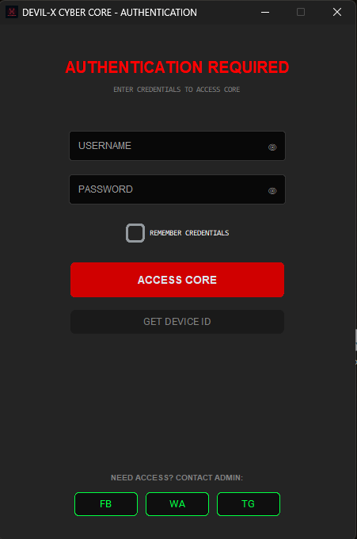
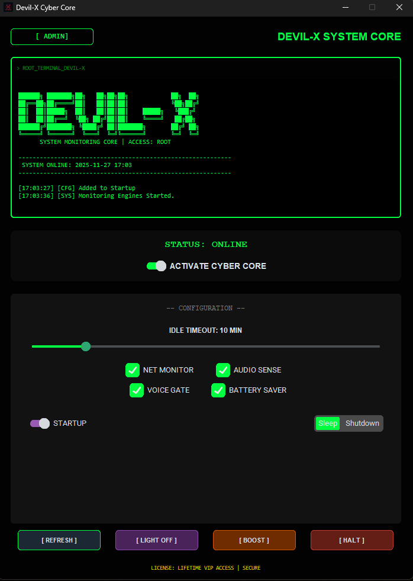

# 🛡️ DEVIL-X CYBER CORE [ULTIMATE EDITION]

> **Codename:** Project Sentinel (v12.0)  
> **Developer:** Md Shamim (Devil-X)  
> **Status:** Active / Stable

---

## 💀 PROJECT DESCRIPTION

**Devil-X Cyber Core** is an elite system monitoring and automation suite designed with a futuristic "Hacker-Style" interface. It serves as a central hub for system diagnostics, security authentication, and automated background tasks.

The **Sentinel Update (v12.0)** introduces advanced background handling, allowing the core to run silently in the system tray while maintaining full operational capability.

---

## 🔥 KEY FEATURES

### 🚀 **New in v12.0 (Sentinel)**
- **System Tray Integration:** The app now minimizes to the system tray (background) instead of closing.
- **Auto-Startup Fix:** Intelligent registry management ensures the Core launches automatically on Windows boot without errors.
- **Single File Architecture:** Compiled into a standalone `.exe` with all assets bundled inside.

### ⚡ **Core Capabilities**
- **Cloud Authentication:** Secure login system verified against a real-time GitHub database.
- **HWID Locking:** Accounts are locked to specific Hardware IDs for maximum security.
- **Smart Sensors:**
  - 🎤 **Audio/Voice Gate:** Detects microphone usage or audio playback.
  - 🌐 **Net Monitor:** Tracks real-time download speeds.
  - 🔋 **Battery Saver:** Adjusts performance based on power source.
- **Stealth Mode:** "Dissolve" animations and "Ghost Mode" for discrete operation.
- **Admin Access:** Special controls for system maintenance (DNS Flush, Tree Refresh).

---

## 📥 DOWNLOAD & INSTALLATION

1. Go to the **[Releases Section](../../releases)**.
2. Download the latest `Devil-X_Core.zip`.
3. Extract the file.
4. Run `Devil-X_Core.exe` as Administrator.

> **⚠️ Note:** Since this tool uses advanced system monitoring hooks, some Antivirus software might flag it as a false positive. Please allow the file or add it to exclusions to ensure full functionality.

---

## 📸 SCREENSHOTS

| Login Interface | Main Dashboard |
|:---:|:---:|
|  |  |

---

## 🛠️ TECHNOLOGIES USED

- **Language:** Python
- **GUI Framework:** CustomTkinter (Modern UI)
- **System Hooks:** WinReg, Ctypes, Pystray
- **Sensors:** Psutil, SoundDevice, Pycaw

---

## 📞 CONTACT DEVELOPER

For access, support, or custom development inquiries, reach out to **Devil-X** directly via the platforms below:

  
  &nbsp; &nbsp;
  
  &nbsp; &nbsp;
  

---

  <b>Developed with ❤️ by Md Shamim</b> 
  <i>"We Are Anonymous. We Are Legion."</i>

